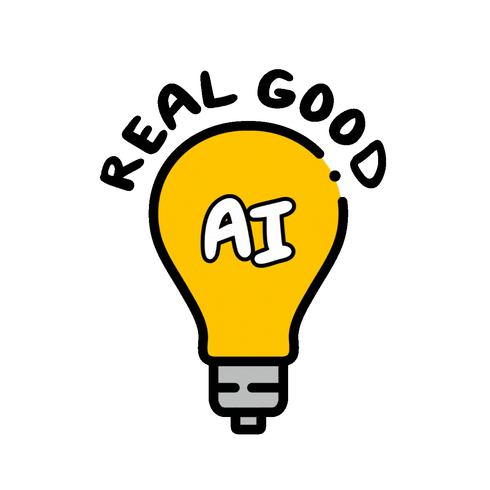

# TrollPyla

## 🤝 Responsible AI Usage

  

TrollPyla is committed to transparent and responsible AI development and follows the principles of the **REAL Rating** framework for disclosing AI usage.

# What is TrollPyla?
A PylaAI fork with some slightly unserious things
## What is TrollPyla?
TrollPyla was created to add a bit more fun to the original PylaAI version
## How can I start TrollPyla?
- Download or clone the repository
- Open setup.bat and then start.bat
- Enjoy your troll pyla experience!
## Which are the answers to the questions?
- You need to find out yourself!
## Developer Notes
- Disclaimer: This content is intended purely as satire and comedy. Any references to real people are made in a casual, humorous context and are not meant to be taken seriously. It is created solely for entertainment purposes.
## Credits
### Developers of original project:
- AngelFire
- iyordanov
